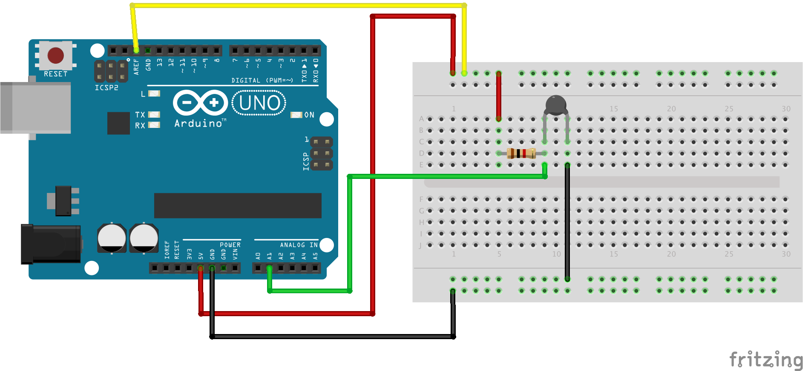
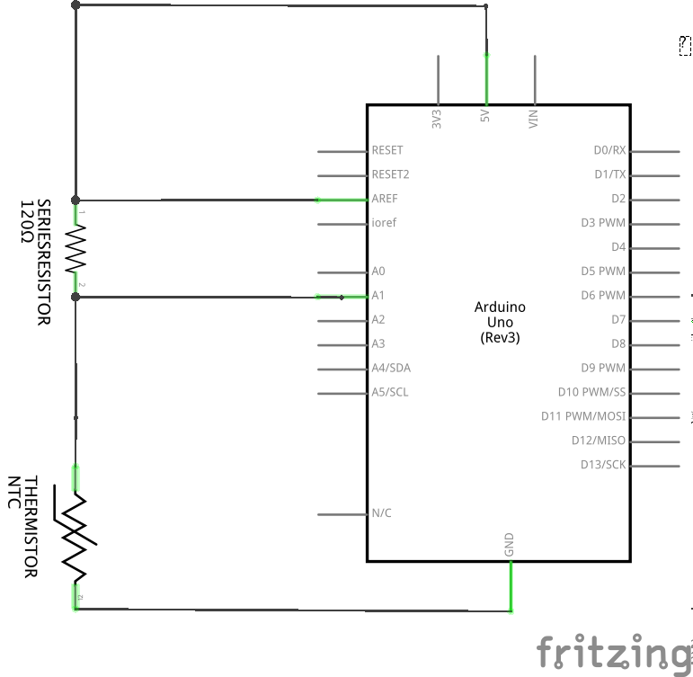

## Thermistor

This circuit has been tested and although not calibrated gives an
approximate value for temperature.
There are many ways you could improve the accuracy.

### Components
* 120 Ohm resistor
* NTC-10D-11 Thermistor
* Arduino
* Wires

### Breadboard layout for the Thermistor v2 Circuit

### Circuit Diagram for the Thermistor v2 Circuit

