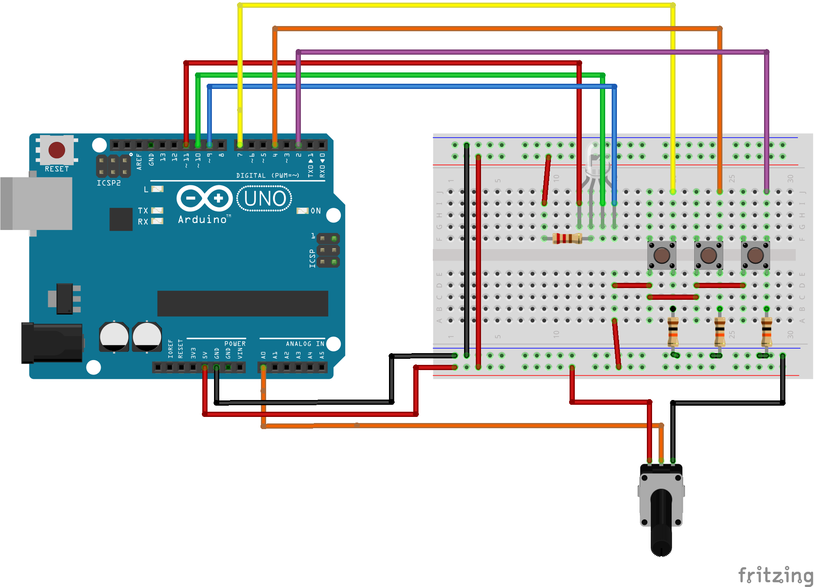
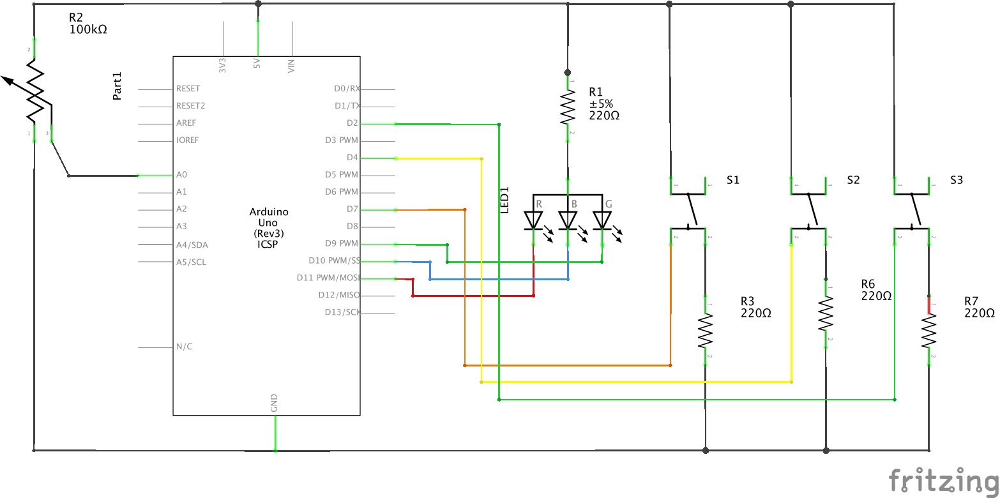

## Selecting RGB led

This is the challenge set, to be able with one or more buttons, change the brightness of all the LED's in the RGB LED

### Breadboard layout with Common Anode RGB_LED
Adding 3 buttons with 10K pull-up resistors

### Circuit Diagram of Common Cathode Advanced_RGB_LED

