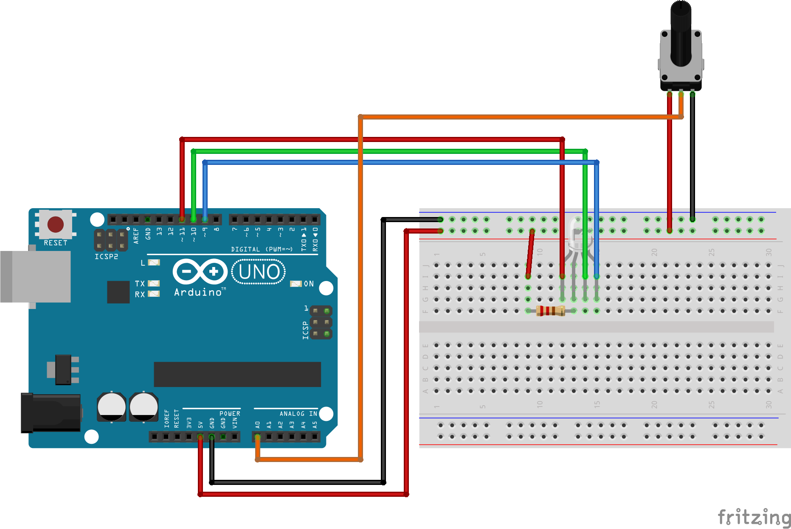
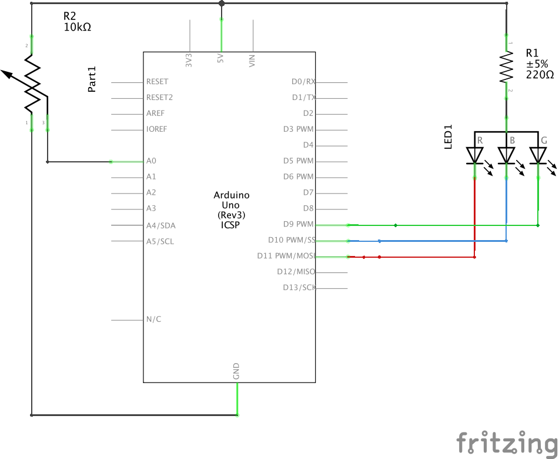
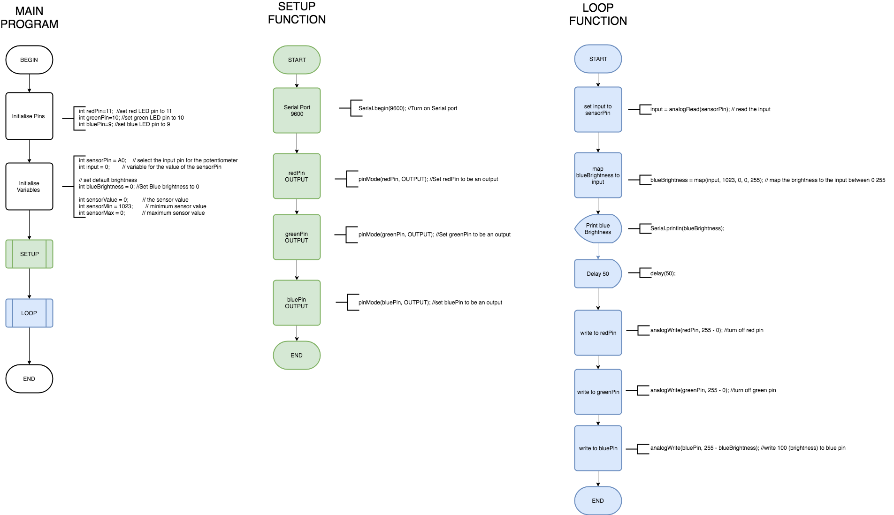

## RGB LED with Common Anode
Advanced circuit and code to setup a Common Anode RGB LED with a Potentiometer (POT)

### Image of Common Cathode and Common Anode RGB_LED

### Breadboard layout of Common Anode RGB_LED

### Circuit Diagram of Common Cathode Advanced_RGB_LED

### Circuit Diagram of Common Cathode Advanced_RGB_LED
{Right click and open image in new tab for bigger image}

