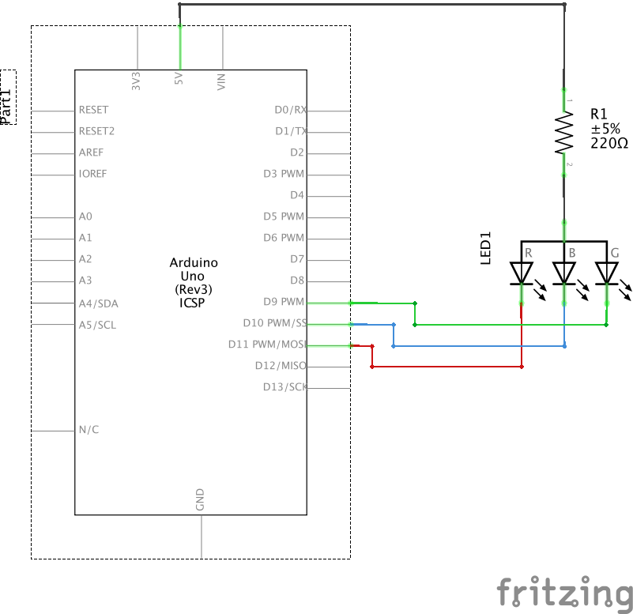

## RGB LED with Common Anode
Basic circuit and code to setup a Common Anode RGB RGB

### Image of Common Cathode and Common Anode RGB_LED

### Breadboard layout of Common Anode RGB_LED

### Circuit Diagram of Common Cathode Basic_RGB_LED

